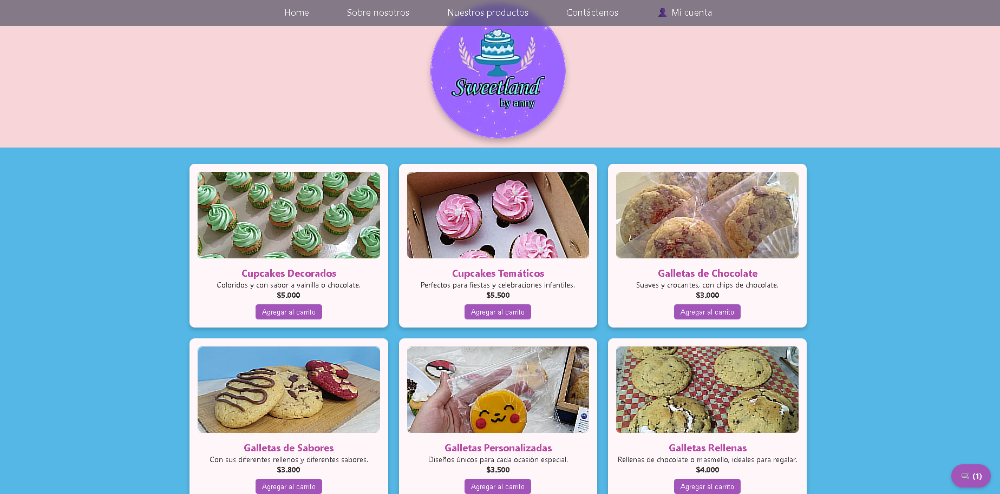
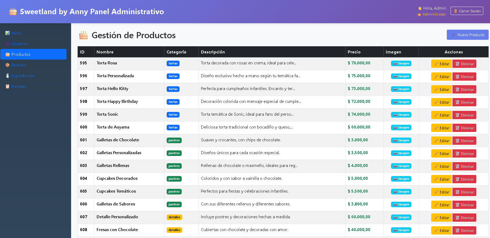

# 🎂 Sweetland by Anny

**A complete business management system for a pastry shop** — connecting an attractive customer storefront with a powerful admin panel through a shared REST API.

Sweetland by Anny is a full-stack web application designed to meet the real operational needs of a Colombian artisanal pastry business. It allows customers to browse products, add them to a cart, and place orders via WhatsApp, while the owner manages the entire business from an intuitive admin panel: products, inventory, production costs, orders, and more.

## 🏗️ Architecture

The system consists of three integrated layers:

- **Customer Landing Page** (HTML + CSS + Vanilla JS)
- **Admin Dashboard** (React + Vite)
- **Backend API** (Flask + MySQL) — shared between both frontends

## 🛠️ Tech Stack

- **Backend**: Python 3.11, Flask, Flask-Login, Flask-CORS, MySQL 8.0
- **Admin Panel**: React 18 + Vite
- **Customer Storefront**: HTML5, CSS3, Vanilla JavaScript
- **Authentication**: Session-based with secure password hashing (Werkzeug)
- **Image Storage**: Local filesystem served by Flask

## ✨ Key Features

### For Customers
- Dynamic product catalog
- Persistent shopping cart
- Direct WhatsApp ordering
- Optional registration and order history tracking

### For the Administrator
- Full CRUD of products with image upload
- Ingredient inventory management
- Recipe system for automatic production cost calculation
- Order management and status tracking
- User and role management

### 📸 Evidence of Operation

| 🛒 Customer Storefront | ⚙️ Admin Control Panel |
| :---: | :---: |
|  |  |
| *Showcasing dynamic product catalog and shopping cart.* | *Managing inventory, orders, and production costs.* |

## 🚀 Getting Started

### Prerequisites
- Python 3.11+
- Node.js 18+
- MySQL 8.0

### Installation

1. Clone the repository
2. Setup the database:
   ```bash
   mysql -u root -p < database/scripts/sweetland_db_v1.sql
3. Backend
   cd backend
python -m venv venv
venv\Scripts\activate
pip install -r requirements.txt
python app.py
4. Admin Panel
   cd admin-panel/mi-app
npm install
npm run dev
5. Landing Page
   Open the landing-page folder using Live Server (VS Code extension).


## 👨‍💻 Author

**Luis Esquivel**
[GitHub](https://github.com/L-Esquivel)

---

## 📄 License & Intellectual Property
This project is for portfolio demonstration purposes only.

**Copyright © 2026 Luis Alejandro Esquivel Rojas. All rights reserved.**

The source code, database schema (`sweetland_db_v1.sql`), and architectural design are the exclusive intellectual property of the author. Unauthorized copying, modification, or distribution of this software is strictly prohibited.
